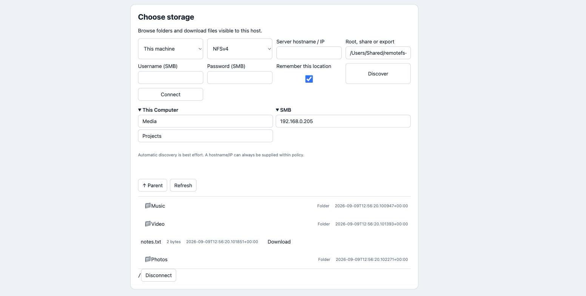

# Remote filesystem browser

**Browse local, SMB and NFS storage over HTTP from another machine.**

Install it on any machine inside a network, then browse the storage that machine can see from anywhere you can reach its HTTP port. A Mac mini, a workstation, a server or a homelab node becomes a remote filesystem manager: it shows its own disks and mounted volumes, and the SMB shares and NFS exports it can reach, without mounting anything, syncing anything or giving the viewer direct access to the NAS.

```text
This Computer
├── Home
├── Mounted volumes
└── Attached storage

SMB
├── NAS
├── Windows shares
└── Other SMB servers

NFS
├── NAS exports
└── Server exports
```

"The whole network" means what that host can reach and what its policy and credentials permit. That is the useful bit: the browser works from the network perspective of the machine you installed it on.



## Quick start

Choose an installation method below, then run `remotefs serve`.

### Homebrew (macOS)

Install from the [Homebrew tap](https://github.com/mightymorgs/homebrew-tap) with [Homebrew](https://brew.sh/):

```sh
brew tap mightymorgs/tap
brew install mightymorgs/tap/remotefs
remotefs serve
```

The formula installs Python and libnfs as dependencies. To run it in the background instead of keeping a terminal open:

```sh
brew services start remotefs
remotefs account --username YOUR_NAME
```

Use `brew services stop remotefs` to stop it. To update, run `brew update` followed by `brew upgrade mightymorgs/tap/remotefs`. See the [Homebrew tap documentation](https://docs.brew.sh/Taps) for how third-party packages are installed.

### WinGet (Windows x64)

The WinGet package has been [submitted for review](https://github.com/microsoft/winget-pkgs/pull/432620) and is awaiting acceptance into the community repository. Once accepted, run in PowerShell with [WinGet installed](https://learn.microsoft.com/en-us/windows/package-manager/winget/):

```powershell
winget install --id mightymorgs.remotefs --exact --source winget
remotefs serve
```

Until WinGet accepts the package, download the [Windows x64 ZIP](https://github.com/mightymorgs/remote-fs-browser/releases/download/v0.2.1/remotefs-0.2.1-windows-x64.zip), extract it, and run `remotefs\remotefs.exe serve` from PowerShell. The portable executable includes libnfs and does not require a separate Python installation. If `remotefs` is not found after installation, open a new terminal. To update:

```powershell
winget upgrade --id mightymorgs.remotefs --exact --source winget
```

See [WinGet install options](https://learn.microsoft.com/en-us/windows/package-manager/winget/install) for the command syntax. Maintainers can find the publication steps for both packages in [Releasing remotefs](packaging/RELEASING.md).

### Python (Windows, macOS or Linux)

Requires Python 3.11+ and pipx. Install from [PyPI](https://pypi.org/project/remote-fs-browser/):

```sh
pipx install remote-fs-browser
remotefs serve
```

You can also install directly from a checkout of this repository:

```sh
pipx install .
remotefs serve
```

### Open the browser

On first interactive launch, choose a username and password (at least 12 characters), then open `http://127.0.0.1:8080/`. The private config stores a salted scrypt password hash, not your password.

Set up or reset the account separately with `remotefs account --username YOUR_NAME`; restart the service after changing it. For automation, `--password-stdin` reads the password from standard input without putting it in command-line arguments. A non-interactive service refuses to start until an account exists. The config is `~/.config/remotefs/config.json` (`%APPDATA%\remotefs\config.json` on Windows).

Existing token-based configs are migrated during account setup. The old token becomes an internal storage key so saved NAS credentials remain readable; it no longer authenticates the standalone service. Password changes preserve that key. Back up the private config and `saved.json` together.

The standalone service defaults to read/write access on loopback only. Use `--read-only` to disable mutations, or set an explicit `policy.operations` list. Its default locations are:

- **This Computer**: your home directory and mounted volumes (`/Volumes` on macOS, drive letters on Windows, mounts under `/mnt`, `/media`, `/run/media`, `/srv`, `/data` and `/home` on Linux).
- **SMB and NFS**: servers in the private subnets of the host's physical interfaces (container, VM and tunnel interfaces are ignored), each narrowed to a /24. Press **Scan network** to probe them, or add a server by name.

To reach it from another computer, bind to an interface on purpose:

```sh
remotefs serve --bind 0.0.0.0 --port 8080
# Or one interface only, for example a Tailscale address:
remotefs serve --bind 100.82.14.7
```

The startup banner lists the URLs, warns that the service is reachable from the network, and reminds you that plain HTTP needs a trusted network or an encrypted tunnel. No firewall rule is opened automatically. Authentication is always required.

Narrow or widen what is visible with flags, which replace the defaults rather than adding to them:

```sh
remotefs serve --root /srv/media --root /mnt/backup --allow-network 192.168.1.0/24
remotefs serve --no-defaults --config /etc/remotefs/config.json   # expose only what the config names
```

NFS needs libnfs 6 or newer (included as a Homebrew dependency; for Python installs, use `brew install libnfs` or the platform installers below). Local and SMB browsing work without it. On Windows, listing the shares a server offers needs the optional `remote-fs-browser[smb-enum]` extra, which Windows Defender quarantines during install unless the Python environment is excluded; without it, type the share name and browsing works as usual.

## Shortlist

**Save folder to shortlist** pins the current folder and remembers its connection credentials. The shortlist is encrypted in `saved.json` beside the config using a separate private storage key. Changing your login password does not discard it. **Forget** removes one entry. See [security boundaries](SECURITY.md).

## The browser

The UI and API share one port and origin. Sign-in is its own screen: it verifies your username and password and issues an HttpOnly, SameSite browser cookie lasting eight hours, and **Sign out** revokes it. The picker shows the host's roots and mapped network locations in a sidebar, the folder listing beside it, and collapses to a sources sheet on phones. Downloads stream through the browser's download manager with HTTP Range support, and credentials never appear in download URLs.

- `/?mode=browse` (default): manage files and folders, upload/download, edit UTF-8 text, copy between locations, rename/move and delete.
- `/?mode=select`: choose a directory and copy its credential-free descriptor, for use by other automation.

## System service installs

For an always-on service run as root or SYSTEM, from a checkout on the target host:

- Linux: `sudo scripts/linux/install.sh /path/to/private-config.json`
- macOS: `sudo scripts/macos/install.sh /path/to/private-config.json`
- Windows, elevated PowerShell: `scripts/windows/install.ps1 -Config C:\path\private-config.json`

These install into a private prefix, build the pinned libnfs (macOS uses Homebrew's), and register a systemd unit, launchd daemon or Windows startup task running `remotefs serve --no-defaults --config …`, so only the roots and networks in the private config are exposed. Start from `examples/config.example.json`: set `local_roots`, `network_ranges` and `operations`, then run `remotefs account --config /path/to/private-config.json --username YOUR_NAME` before installing the service. Keep the file private. An empty list denies that class of access.

For Ansible, use `playbooks/<platform>/install.yml` with the `filesystem_hosts` group, `remote_fs_source` (destination checkout directory) and `remote_fs_config` (private config path already on the host). macOS also needs `remote_fs_brew_user`; Windows needs `ansible.windows`. The playbooks copy only public source files. Matching uninstall scripts and playbooks stop and remove the service; `--purge` on Unix or `-Purge` on Windows also removes the private installation directory. Never store credentials or real host configurations in Git.

## Python SDK

```python
import asyncio
from remote_fs_browser import Browser, Policy

async def example():
    policy = Policy(local_roots=['/srv/media'])
    async with Browser(policy) as browser:
        async with await browser.connect({'type': 'local', 'root': '/srv/media'}) as fs:
            print(await fs.list('/'))
            print(await fs.stat('/example.mp4'))
            async for chunk in fs.stream('/example.mp4', offset=1024, length=4096):
                consume(chunk)
            selected = fs.descriptor('/Projects')

# Worker processes require the normal multiprocessing main guard on every OS.
if __name__ == '__main__':
    asyncio.run(example())
```

`list`, `stat`, `stream`, `descriptor` and `close` have identical interfaces for all backends. Paths inside a session always use `/`, including on Windows. A local connection's `root` remains a native host path such as `C:/Media`. Entries contain `name`, normalized `path`, `type`, `size`, and UTC `modified` time. Listings report `truncated` when the entry limit was hit and `skipped` for names that cannot be addressed safely (for example a colon or backslash in a filename); nothing aborts the listing.

Connect to SMB with `{'type':'smb','host':'nas.example','share':'Projects'}` and a separate `credentials={'username':..., 'password':...}` argument. NFS uses `{'type':'nfs','host':'nas.example','export':'/exports/media','version':4}`. Set the permitted network ranges first.

The worker is created when connecting to a selected location, not merely when opening the picker. It keeps the protocol connection through subsequent navigation and file reads. `close()` terminates it; abandoned workers exit after the configured idle period (300 seconds by default). Each filesystem operation has a hard deadline (10 seconds by default), so a stuck native call cannot block another session. The reference HTTP service also reaps expired session records.

## HTTP API

The standalone data endpoints require the signed-in browser cookie. Embedded services may configure their own authentication or a bearer credential. The page assets alone are public. Routes are served under `/api/`; the unprefixed forms remain for existing SDK clients.

| Method / route | Purpose |
|---|---|
| `POST /api/login`, `DELETE /api/login` | Sign in with username/password for a browser cookie; sign out |
| `GET /api/discover?scan=false` | Allowed roots and the `groups` tree; `scan=true` also probes permitted ranges |
| `POST /api/discover` | Enumerate shares/exports: `{type, host, credentials?}` |
| `GET /api/saved`, `POST /api/saved`, `DELETE /api/saved/{id}` | Remembered locations for the signed-in principal |
| `POST /api/sessions` | Connect: `{descriptor, credentials?}`; `descriptor.credential_id` reuses saved credentials |
| `GET /api/sessions/{id}/list?path=/` | Entries plus `truncated` and `skipped` |
| `GET /api/sessions/{id}/list?path=/&ndjson=true` | NDJSON response, with `X-Listing-Truncated` and `X-Listing-Skipped` headers |
| `GET /api/sessions/{id}/stat?path=/file` | Normalized metadata |
| `GET /api/sessions/{id}/file?path=/file` | Stream bytes; supports a single `Range: bytes=...` header |
| `GET /api/sessions/{id}/descriptor?path=/folder` | Validated durable directory descriptor |
| `DELETE /api/sessions/{id}` | Close immediately |

File responses use bounded 256 KiB reads. Range requests support explicit, open-ended and suffix ranges; invalid/multiple ranges return 416. Files are served as attachments with `nosniff`. A client disconnect releases its active file handle; the browsing session remains for the configured idle grace period so it can reconnect after a brief interruption. An explicit DELETE closes it immediately.

Directory listings are bounded by `max_entries`; NDJSON streams the bounded result to the client. The service does not lazily page a native directory across HTTP requests. It reports truncation rather than silently claiming a full listing. It never recursively indexes a share.

## Credentials and descriptors

Descriptors never contain credentials. A descriptor can hold `credential_id`; `remotefs serve` resolves it from the remembered locations of the signed-in principal, and an embedding application can supply its own resolver instead.

```json
{"type":"smb","host":"nas.example","share":"Projects","path":"/Campaigns","credential_id":"media-reader"}
```

The SDK accepts `Browser(policy, credential_resolver=lambda reference: ...)`. The reference service accepts `create_app(policy, token=..., credential_resolver=lambda principal, reference: ...)` or `saved_locations=SavedLocations(path, token)`; a resolver must check that the principal owns the reference before returning credentials. The SDK and `create_app` persist nothing on their own. A local descriptor contains `type`, native `root`, and a session-relative `path`; NFS retains `host`, `export`, `version` and `path`.

To customize authentication, pass `authenticate(request) -> principal` and optionally `authorize(principal, operation, descriptor) -> bool` to `create_app`. Hooks can be async. The default bearer token represents one principal; use per-user hooks for separate users. Sessions and saved locations cannot be read by a different principal. The service never logs credentials or request bodies; access logging is disabled by its CLI.

## Frontend

Use `frontend/browser.js` directly or the packaged `/browser.js` asset. It defines `<remote-fs-browser>` and exports `RemoteFsClient`. No React, Vue or build system is required.

```javascript
import { RemoteFsClient } from './browser.js'
const picker = document.querySelector('remote-fs-browser')
picker.client = new RemoteFsClient('/storage-api', () => ({ Authorization: `Bearer ${token}` }))
picker.addEventListener('path-selected', event => saveDescriptor(event.detail))
// Optional: the embedding app saves credentials itself and returns an opaque reference.
// picker.storeCredentials = async credentials => mySecretStore.save(credentials)
```

The element fills the box it is given. It renders the shortlist and the host's roots in a sidebar, network devices from an explicit scan, per-host share and export lists, credential entry, nested folders with formatted sizes and dates, in-place errors with retry, expiry reconnect, downloads in browse mode and a live descriptor preview with a Select button in select mode. The `signout` attribute adds a Sign out button that fires a `sign-out` event for the host page to act on. When the service offers `/api/saved` and no `storeCredentials` hook is set, "Save folder to shortlist" stores the current folder there. It closes its session on selection, disconnect or element removal. Keep the service on the same origin or configure a restrictive CORS policy when embedding across origins. The JS client's `file()` returns a Fetch `Response`; consume its `body` as a stream rather than calling `blob()` for large files.

## Discovery limits

Scan results show the DNS hostname, NetBIOS device name and IP address together whenever the names are available. DNS and NetBIOS are queried independently; devices without either name still show their IP address. Named devices retain a label in the Network sidebar, and connections use the scanned IP address. Both name lookups have deadlines so unavailable name services do not hold up the scan indefinitely.

Discovery probes TCP 445/2049 within permitted CIDRs, at most 256 candidate addresses per page. Custom ranges must remain inside the policy; the next-page offset lets large ranges be scanned without expanding them in memory. This is portable and requires no SMB1 browser service. Manual hostnames work when discovery cannot cross subnets or VPNs. SMB authentication uses NTLM (including domain-qualified usernames). SMB enumeration uses Impacket's SRVS RPC over SMB2; traversal and streaming use smbprotocol's SMB2/3 session. NFS export enumeration uses mountd and may return no exports on NFSv4-only servers; enter the export manually in that case. NFS uses AUTH_SYS UID/GID behaviour from libnfs and the service account; NFS Kerberos is not configured.

This project is a filesystem manager with an embeddable path picker. It does not provision mounts, manage backups, sync files, or abstract cloud object storage. It is a reference service and embedding SDK, not a hardened multi-tenant filesystem sandbox: see [security boundaries](SECURITY.md) and [validation](VALIDATION.md) before exposing it beyond a trusted network.

## Development

```sh
pip install -e '.[test]'
pytest
python -m build
```

Releases are built by `.github/workflows/release.yml`; `packaging/RELEASING.md` describes publishing to PyPI, the Homebrew tap and winget.

MIT licensed. Protocol implementations are dependencies, not copied sources: [smbprotocol](https://github.com/jborean93/smbprotocol), [Impacket](https://github.com/fortra/impacket), and [libnfs](https://github.com/sahlberg/libnfs). Libnfs has its own LGPL licensing; installers fetch or build it separately. Preserve its license obligations if distributing a bundled native library.

### Creating a directory (embedding API)

Folder creation is opt-in: include `mkdir` in `Policy.operations` alongside the
read operations you need. Then `POST /api/sessions/{id}/mkdir` with
`{"path":"/new-folder"}` creates one directory inside that session's root.
Local, SMB and NFS backends use the service/session's filesystem permissions;
existing folders are not overwritten. The default policy remains read-only.

Third-party licence notices are documented in [THIRD_PARTY_NOTICES.md](THIRD_PARTY_NOTICES.md). Windows portable releases include dependency licence texts and the matching modified libnfs source, build recipe and DLL replacement instructions.

## File operations

Local folders, SMB shares and NFS exports support uploads, downloads, new files, folder creation, rename/move, copy and deletion. The browser includes a UTF-8 editor for files up to 1 MiB. Use **Copy**, open another folder or location, then **Paste** to copy across backends. Copies never replace an existing destination. Upload replacement is explicit.

| API | Operation |
| --- | --- |
| `PUT /api/sessions/{id}/file?path=/file&overwrite=false` | Stream a raw binary upload |
| `POST /api/sessions/{id}/mkdir` | `{"path":"/folder"}` |
| `POST /api/sessions/{id}/rename` | `{"source":"/old","destination":"/new"}` |
| `POST /api/sessions/{id}/copy` | `{"source":"/file","destination":"/copy","target_session":"optional-other-session"}` |
| `DELETE /api/sessions/{id}/entry?path=/folder&recursive=true` | Delete a file or folder tree |

The SDK `Policy` still defaults to read-only. Add `write`, `mkdir`, `rename`, `copy` and `delete` individually to grant mutations. `FilesystemSession.write(path, async_byte_chunks, overwrite=False)` streams an upload; `copy`, `rename`, `mkdir` and `remove` expose the other operations. HTTP authorization hooks check source and destination access and preflight recursive copy/delete entries. Sessions belong to the signed-in user.

Uploads are staged beside the destination and committed after the full body arrives; ordinary cancellation cleans the temporary file and keeps the original. The default upload limit is 10 GiB (`max_write_bytes`). A killed process or lost server connection can leave a `.remotefs-*.part` file; remove stale files after checking no upload is active. Atomic replacement inherits the staging file's permissions/ACLs (local replacement preserves permission bits), so this is not an ACL-preserving backup tool.

Folder copies, recursive deletes and NFS folder moves run in steps. An error can leave partial results: refresh both locations before retrying. NFS folder moves create destinations exclusively and move files with server-side links before removing empty source folders. They are not atomic. Servers must support hard links for non-overwriting NFS file publication/moves. Symlinks, reparse points and special files are excluded; a recursive operation with hidden or truncated entries is rejected. Directory operations are bounded by `max_entries` and a depth of 64. The editor does not lock out other clients; the last explicit save wins.

Filesystem ownership, POSIX permissions and server ACLs remain authoritative. The app does not expose arbitrary shell commands, ownership changes, ACL editing, symlink creation or mount administration.
